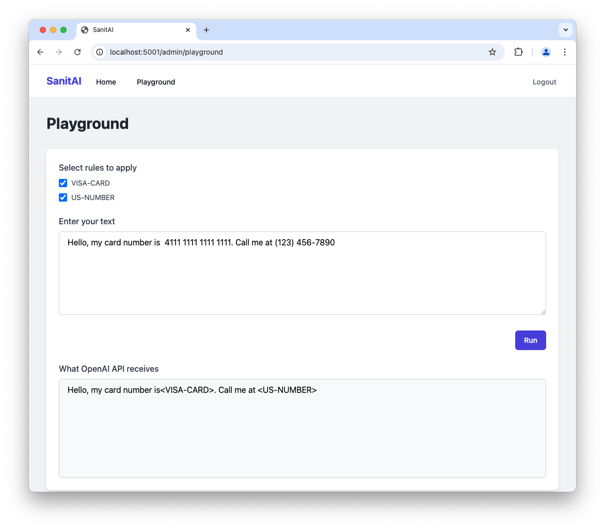

# SanitAI

A secure middleware that sanitizes OpenAI API traffic by:

- Automatically detecting and removing Personal Identifiable Information (PII)
- Preserving message context and meaning
- Operating as a drop-in proxy for existing OpenAI integrations

What your user sends:

> Hello, my card number is 4111-1111-1111-1111. Call me at (123) 456-7890

What the OpenAI API sees:

> Hello, my card number is `<VISA-CARD>`. Call me at `<US-NUMBER>`

1. [Video tutorials](#video-tutorials)
2. [Screenshots](#screenshots)
3. [Getting started](#getting-started)
4. [Deployment](#deployment)
5. [Features](#features)
6. [Running on ARM/Apple silicon](#running-on-arm-apple-silicon)


## Video tutorials

1. [Introduction + adding a new rule](https://youtu.be/bdA7T6Z6YQ4)
2. [Improving a rule with the AI agent](https://youtu.be/Pi3P_qiIfzE)
3. [Using SanitAI with the OpenAI Python package](https://youtu.be/y40lB_SAuew)

## Screenshots

### Dashboard


### Playground




### Rule creation wizard


## Getting started


```sh
# get the code
git clone https://github.com/edublancas/sanitAI
cd sanitAI/

# set your OpenAI key (used for the agent that helps you define the PII rules)
export OPENAI_API_KEY=SOME-OPENAI-KEY

# build the docker image
# NOTE: if building using ARM (Apple silicon, read the section at the end)
docker build -t sanitai .

# run
docker run -p 5001:80 --rm --name sanitai \
-e OPENAI_API_KEY=$OPENAI_API_KEY \
sanitai
```

Then, open: `http://localhost:5001/admin/`

Login:

- Email: admin@example.com
- Password: admin123


You can test it in the `Playground` tab. Alternatively, you can run the `sample.py`
script:

```sh
export OPENAI_API_KEY=SOME-OPENAI-KEY
pip install openai

python example.py
```

Then, look at the logs from the server and you'll see that the user sent:

> Hello, my card number is 4111-1111-1111-1111. Call me at (123) 456-7890

But the proxy intercepts the request and sends this to OpenAI:

> Hello, my card number is `<VISA-CARD>`. Call me at `<US-NUMBER>`


This is the source code for `example.py`:

```python
from openai import OpenAI


# point to the proxy
client = OpenAI(base_url="http://localhost:5001/proxy/v1")

response = client.chat.completions.create(
    model="gpt-4o-mini",
    messages=[
        {"role": "system", "content": "You are a helpful assistant."},
        {
            "role": "user",
            "content": "Hello, my card number is  4111 1111 1111 1111. Call me at (123) 456-7890",
        },
    ],
)

print(response.choices[0].message.content)
```


## Deployment

You can deploy this to any platform that supports containerized applications (e.g.
[Ploomber Cloud](https://ploomber.io/)). The app runs on a single container (see the `Dockerfile`), and spawns the proxy and the UI via supervisord and NGINX.

If you're looking for enterprise support, [contact me](https://github.com/edublancas).

## Features

1. Drop-in proxy for OpenAI (no need to change your code)
2. UI to admin and test rules
3. AI agent to add new rules
4. AI agent to fix rules

## Running on ARM (Apple silicon)

If you're running on ARM (Apple silicon), uncommend uncomment the line that installs
[spaCy](https://github.com/explosion/cython-blis/issues/9#issuecomment-522320875) in
the `Dockerfile`.
